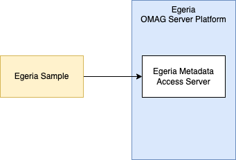
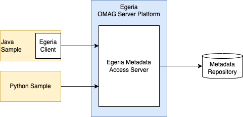

<!-- SPDX-License-Identifier: CC-BY-4.0 -->
<!-- Copyright Contributors to the ODPi Egeria project. -->

# Egeria API Samples (egeria-samples-api)

This repository is a collection of samples that show how to use Egeria's metadata
management and governance APIs to set up and run a sustainability initiative at
the fictitious company
[Coco Pharmaceuticals](https://egeria-project.org/practices/coco-pharmaceuticals/).

Sustainability reporting is increasingly required by governments and financial institutions. 
Companies are encouraged to set targets to reduce their emissions 
and to report on their progress towards these targets. 
The [Greenhouse Gas Protocol](https://ghgprotocol.org/) defines the foundational methods for this process.

Improving the sustainability of an organization is a continuous process of:

* reviewing its operations
* measuring the impact of these operations
* aggregating these impacts across locations and divisions of an organization
* reviewing, certifying and reporting on sustainability
* setting targets to improve sustainability
* taking action to achieve these targets
* measuring the change
* *repeat*

All parts of the organization need to be involved.
Investment in automation around this process is also important
to ensure ongoing improvements to data collection and remediation actions that
improve the sustainability of their operations becomes embedded in the business,
not something they focus on from time-to-time.

The samples are divided into the following groups:

* [Extending the governance program](#extending-the-governance-program) to include a sustainability focus.
* [Creating an inventory](#creating-the-operations-inventory) of Coco Pharmaceuticals operations.
* [Finding and cataloguing the data](#finding-and-cataloguing-data) that describes the impact of their operations.
* [Validating and publishing sustainability report](#building-the-sustainability-dashboard) to continuously monitor the sustainability status of Coco Pharmaceuticals. 
* [Assessing and improving IT operations](#assessing-and-improving-it-systems).
* [Sustainability Webpages](#sustainability-webpages)

## Bringing the samples onto your local machine

### Just want to build and run

If you want to just build and run the samples, all you need to do is clone this
git repository.  Create a new directory (folder) on your machine, open a terminal (command) window; change into your new directory and enter:

```
git clone https://github.com/odpi/egeria-samples-api.git
```

on the command line and press *return*. The code is copied into your new directory, and you're ready to build or load it into an IDE.

### Wanting to contribute new code and documentation

New contributions are added to the git repository using a *Pull Request* from a personal *Fork*.  If you want to contribute to this git repository, then you need to create a fork of the repository and then create a clone of the repository from your fork.

* If this is the first git project you have setup, you need to configure the email address and name using the commands below. The email address should match the email you use for github so that your contributions are recognized.
```
git config --global user.name 'My Name'
git config --global user.email 'myuser@myemail.org'

```
* Go the repository's page on Github at https://github.com/odpi/egeria-samples-api and click on 'Fork' towards the top right of the page. This creates your own copy of the repository which is where you'll keep your work in progress.
* Next, clone the repository (this copies it down to your local environment):
    ```
    git clone https://github.com/<yourGitUserId>/egeria-samples-api.git
    ```
* Finally add an additional 'remote' - this makes it easier to retrieve updates other people may have made to the repository - which you'll need to do before pushing a PR.
    ```
    git remote add upstream https://github.com/odpi/egeria-samples-api
    ```

## Building the samples

Most of the samples are written in Java, although there are a couple that are in python.

### Working with Java

Egeria requires version 11 of Java, but also supports version 17, which is the latest Long Term Service release (LTS).

You will need a Java Development Kit (JDK) installed on your machine in order to build the Java samples. (A JDK will include a JRE.)

There are various JREs/JDKs available, and you may even have one pre-installed on your system. You can check if java is already installed by running the command `java --version` from the command-line.

Java can be installed by:

* Downloading the OpenJDK 11 (LTS) HotSpot JVM from [Adoptium](https://adoptium.net/en-GB/installation/).
* Running the installer that is downloaded.

Alternatively you may wish to install from your package manager such as homebrew on MacOS.

The java samples are built using gradle.  This will start to run automatically when you load the project into an IDE such as IntelliJ.  Alternatively, gradle will run from the root directory of the downloaded project using the following command:

For Linux, macOS:
```
./gradlew build
```

Or for Windows:
```
./gradle.bat build
```

Samples that need some work on are described in the [GitHub Issues](https://github.com/odpi/egeria-samples-api/issues) for this repository.

### Working with Python

Egeria uses version 3 of python.  There are various mechanisms for acquiring python for your machine.  You will need the following packages to be installed.

* csv
* time
* os
* urllib3
* requests
* pprint
* json

## Running the samples

Each sample is located in its own directory.   The [samples-ensemble](https://github.com/odpi/egeria-samples-api/tree/main/samples-ensemble) module will run all the Java samples.

The samples are all client applications that call a [Metadata Access Server](https://egeria-project.org/concepts/metadata-access-server/) running on the [Egeria OMAG Server Platform](https://egeria-project.org/concepts/omag-server-platform/).  The metadata repository is preloaded with an [open metadata archive](https://egeria-project.org/concepts/open-metadata-archive/) that contains sample metadata from Coco Pharmaceuticals.  This archive is called [CocoComboArchive.json](https://github.com/odpi/egeria-samples/blob/master/content-packs/CocoComboArchive.json) and [can be loaded](https://egeria-project.org/features/metadata-archiving/overview/#loading-open-metadata-archives) as part of the metadata access server's startup configuration, or later, once the server is running.



Whether you choose to run a sample individually or through *samples-ensemble*, you need to supply three pieces of information:

* The *serverURLRoot* of the OMAG server platform.
* The *serverName* of the metadata access server
* The *userId* to use on the calls.

This information is provided from the Egeria deployment environment.

## Structure of the samples

The java samples call an Egeria client, which in turn calls the REST API of Egeria.  The Javadoc for the clients is published here: [https://odpi.github.io/egeria/index.html](https://odpi.github.io/egeria/index.html).

The python samples call the REST APIs directly because Egeria does not have any python client libraries (yet :).  Details of the REST API for Egeria can be found by linking to the Swagger UI at *serverURLRoot*/swagger-ui.html.



## Understanding Sustainability Reporting

The GHG Protocol defines strategies, processes and techniques for collecting and calculating carbon emissions. Three classes of emissions are defined:

* Scope 1 - Direct Emissions from Operations
* Scope 2 - Indirect Emissions from Utility Consumption
* Scope 3 - Other indirect emissions

Most reporting is focused on Scope 1 and Scope 2; for Scope 3 there is often a limited focus on business travel.

Calculations for each kind of emission is specified in the GHG Protocol. Reference data supporting these calculations varies over time, location, and sometimes industry - so we need to perform the calculations on a location by location basis and then aggregate this information. This is also useful since we can more easily compare locations and identify the different challenges they face. As we perform these calculations it is important that we record how the results are computed, including which reference data were used.

## More information on the samples

The samples are divided into related groups ...

### Extending the governance program

Coco Pharmaceuticals has an existing governance program that helps them manage their operations.
This governance program is divided into multiple governance domains that each focus on a specific aspect of their
operations.  For example, they have a domain for data governance, a domain for security and a domain for privacy.

The samples for extending the governance program show how to add a new governance domain for sustainability.

[Go to code ...](governance-program)

### Creating the operations inventory

Coco Pharmaceuticals need to report on all aspects of their operation.  
To ensure they have not missed anything, and to identify where improvements can be made,
they need lists of their locations and the equipment and activity at each location.  This is called the operations
inventory and provides a context for the data they collect.  

For example, they have utility bills for each of the sites they operate.  
The operations inventory will tell them what type of activities - such as office work, 
manufacturing, research, ...) are occurring at each site, what types of equipment runs there and
which part of the business is responsible for each aspect. With the inventory they can apportion the power or
water use to these aspects and then review the data from different perspectives:

* Business area (and hence associated revenue)
* Types of activity
* Types of facilities (such as offices, data centres, )
* Types of equipment (such as IT systems, refrigeration units, robots, vehicles, ...)

This way they can pick the most important things to change first.

The samples for building the operations inventory show how to define new types of equipment, catalog the
locations, facilities, equipments and activities at each location and issue queries to show different 
parts of the inventory.

[Go to code ...](operations-inventory)

### Finding and cataloguing data

Understanding the impact of operations takes more than utility bills.  It is important to understand
impact of travel, loss of coolants (such as CFCs), fuel for manufacturing equipment, ...

Data about these impacts need to be catalogued so the teams analysing the data and making choices on actions
to take can find the data. 

The catalog entries for this data need to link to the appropriate parts of the operations inventory to provide
context to the data.  Different locations will often have different sources of data. Often data from different sources uses different units, terminology and reference values.
The process of cataloguing data must capture this type of detail to make it consumable by the analysis processes. 

The samples for cataloguing data show how to catalog data and link/tag it, so it is ready for analysis.

[Go to code ...](cataloguing-data)

### Building the sustainability dashboard

In order to keep sustainability in people's minds (and to provide data to the different stakeholders ),
Coco Pharmaceuticals want to have a set of dashboards and reports that shows their current status and how it is changing
(better or worse) over time.

Data pipelines take the raw data they have, and normalize the data so that the CO2 equivalent emissions can be calculated using standard techniques. transform and combine it into a sustainability database that supplies
data to these new dashboards and reports.

The samples for the sustainability dashboard includes building the data pipelines, cataloguing them
and recording lineage to show the origin of the data in the reports/dashboards. Lineage is especially important in certifying the accuracy of reported metrics.

[Go to code ...](sustainability-dashboard)

### Assessing and improving IT systems

IT systems (computers) use a lot of electricity.

Coco Pharmaceuticals use many IT systems to run their business, automate their factories, depots, and labs.
The research work in particular requires powerful machines running calculations and other analytics to identify,
develop and validate their treatments.

The number of IT systems continues to grow since new systems are often added and old systems are rarely removed.
One surefire way to reduce the impact of their operations is to remove obsolete IT systems and streamline/consolidate their
processing onto a smaller number of more power efficient computers.

[Go to code ...](it-systems)

## Sustainability webpages

Different personas need different information to help them understand the sustainability of their area of responsibility,
and the impact of the changes they are making on the situation.  The sustainability webpages show different views of
the Egeria information targeted for different personas.

[Go to code ...](sustainability-webpages)


----
License: [CC BY 4.0](https://creativecommons.org/licenses/by/4.0/),
Copyright Contributors to the ODPi Egeria project.
