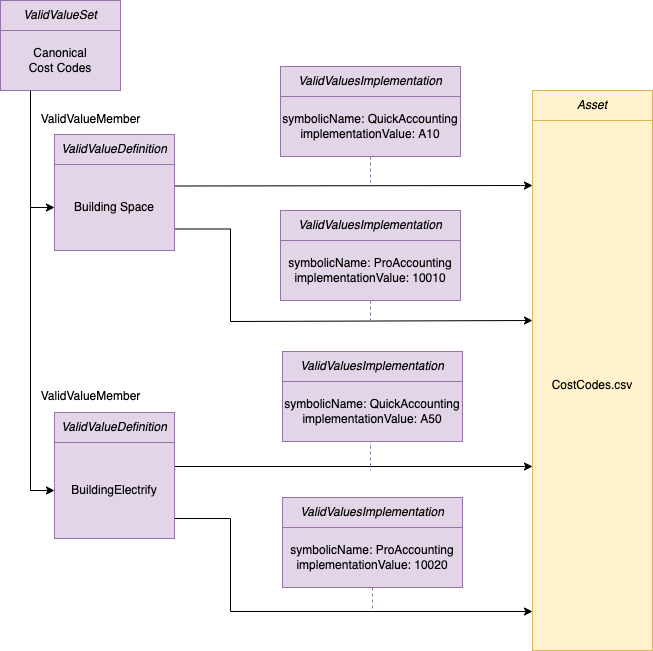

<!-- SPDX-License-Identifier: CC-BY-4.0 -->
<!-- Copyright Contributors to the Egeria project. -->

# Map reference data between GHG protocol and Coco Pharmaceuticals' reference data

The Greenhouse Gas (GHG) protocol provides a spreadsheet to perform the emissions calculations.
The data from the organization has to be transformed into the right format before adding to the spreadsheet.
One type of transformations required is to map code values and units (reference data) to the values needed in
the spreadsheet.

This task creates a reference data mapping table in Egeria for use by the data pipeline that prepares
the data for the spreadsheet.  This involves creating a valid value set for each of the internal formats and one for the
GHG protocol values and then map them together.  The sample then demonstrates how to use Egeria to take a value
from one valid value set and retrieve the equivalent value from another.

The data folder for this sample includes a file called `CostCodes.csv`.

It includes information extracted from the GHG spreadsheet plus the equivalent codes from the two accountancy
packages that Coco Pharmaceuticals uses: *QuickAccounting* and *ProAccounting*.

This sample further shows how to catalog these values so that this mapping table can be
managed automatically as new codes are required.

----
License: [CC BY 4.0](https://creativecommons.org/licenses/by/4.0/), Copyright Contributors to the Egeria project.
