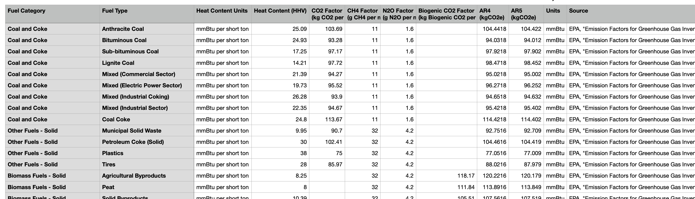
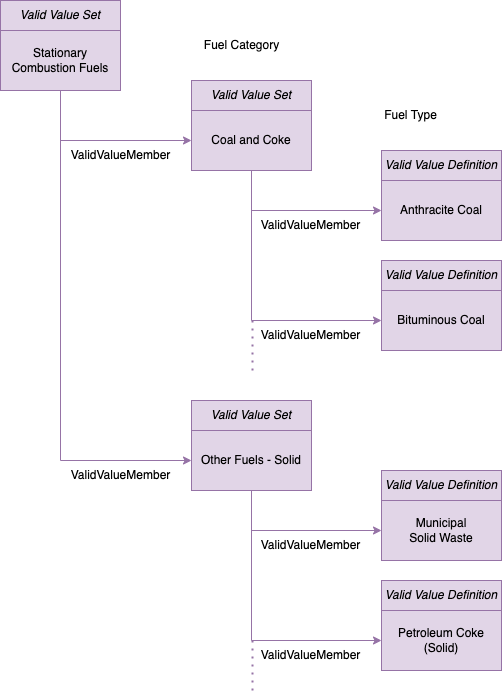

<!-- SPDX-License-Identifier: CC-BY-4.0 -->
<!-- Copyright Contributors to the Egeria project. -->

# Create a valid value set for GHC protocol

Valid value sets are used to capture look up values for data processing pipelines.
This sample shows how to capture a set of hierarchical values that are found in the
`Stationary Combustion Fuels.csv` file that looks like this:

This sample loads the content of the csv file into a hierarchical valid value set
called *Stationary Combustion Fuels*.

The properties are set up in the Valid Value elements as follows:

### Top-level Stationary Combustion Fuels element

| Property Name | Comes from ... |
| :------------ | :------------- |
| typeName | "ValidValueSet" |
| qualifiedName | "ValidValue: Stationary Combustion Fuels" |
| displayName | ""Stationary Combustion Fuels" |
 | scope | ""GHG Protocol" |

### Fuel Category element

| Property Name | Comes from ...                                                 |
| :------------ |:---------------------------------------------------------------|
| typeName | "ValidValueSet"                                                |
| qualifiedName | "ValidValue: " plus the name from the **Fuel Category** column |
| displayName | Name from the **Fuel Category** column                         |
| scope | "GHG Protocol"                                                 |
| usage | Value from the **Heat Content Units** column                   |

### Fuel Type element

| Property Name         | Comes from ...                                             |
|:----------------------|:-----------------------------------------------------------|
| typeName              | "ValidValueDefinition"                                     |
| qualifiedName         | "ValidValue: " plus the name from the **Fuel Type** column |
| displayName           | Name from the **Fuel Type** column                         |
| scope                 | "GHG Protocol"                                             |
| usage                 | Value from the **Heat Content Units** column               |

Plus the additionalProperties map is populated using the column name as the key and the column value as the value for the following columns.

* Heat Content (HHV)
* CO2 Factor (kg CO2 per mmBtu)
* CH4 Factor (g CH4 per mmBtu)
* N2O Factor (g N2O per mmBtu)
* Biogenic CO2 Factor (kg Biogenic CO2 per mmBtu)
* AR5 (kgCO2e)
* Units
* Source

----
License: [CC BY 4.0](https://creativecommons.org/licenses/by/4.0/), Copyright Contributors to the Egeria project.
