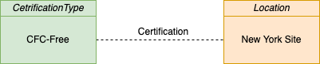

<!-- SPDX-License-Identifier: CC-BY-4.0 -->
<!-- Copyright Contributors to the Egeria project. -->

# CFC-free certification type

A certification type describes a particular state or type of activity that is recommended or required
by a governance program.  One of the damaging chemicals we use are refrigerants such as
Chlorofluorocarbons (CFCs) and Hydrochlorofluorocarbons (HCFCs) because they contribute to ozone depletion
in the upper atmosphere.

CFCs and HCFCs are being phased out globally and this action has already had a positive effect on our ozone layer.
Coco Pharmaceuticals is keen to be "CFC-free" as soon as possible, and plan to reward the people
at each site with a celebration party when they become CFC-free.

This sample is in two parts:

* Creation of the "CFC-Free" certification type to represent that a site or facility is CFC-Free.
* Linking the "CFC-Free" certification type to the New York site location to *certify* that it is now CFC-Free.

This sample can be run multiple times, so it begins by deleting the elements it plans to create if they are already defined in the metadata server.

----
License: [CC BY 4.0](https://creativecommons.org/licenses/by/4.0/), Copyright Contributors to the Egeria project.