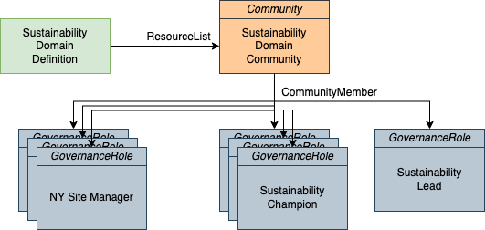

<!-- SPDX-License-Identifier: CC-BY-4.0 -->
<!-- Copyright Contributors to the Egeria project. -->

# Sustainability Governance Community

Governance, such as managing the sustainability of an operation, typically involves people from across the organization.  
The traditional team (department) structure is designed to organize people for the every-day work of the business.

This sample creates a *community* for people involved in the sustainability initiative.
The community is used to provide education and other information that is useful to people 
working on sustainability at Coco Pharmaceuticals.Communities also serve as the backbone for formal and informal collaborations between individuals and teams across the company.

There are three parts to the sample:

* List the existing communities and add a new community for the sustainability initiative.
* List the governance roles that have the sustainability domain identifier or "9" and link them into the community.
* List the governance domain definitions and if there is one defined for sustainability, link the community as a "resource" for the governance domain.

This sample can be run multiple times, so it begins by deleting the elements it plans to create if they are already defined in the metadata server.

## Sustainability Community Values

| Attribute Name | Value                                                                                                                                           |
|----------------|-------------------------------------------------------------------------------------------------------------------------------------------------|
| qualifiedName  | Community:Sustainability                                                                                                                        |
| displayName    | Sustainability Domain Community                                                                                                                 |
| description    | Community of people working to mprove the use of resources in order to operate Coco Pharmaceuticals in a sustainable and non-damagining manner. |

----
License: [CC BY 4.0](https://creativecommons.org/licenses/by/4.0/), Copyright Contributors to the Egeria project.