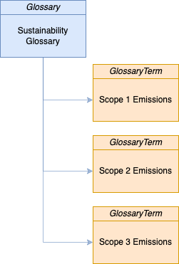
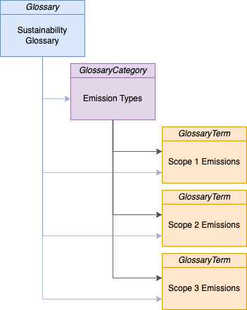

<!-- SPDX-License-Identifier: CC-BY-4.0 -->
<!-- Copyright Contributors to the Egeria project. -->

# Sustainability Glossary

The GHG protocol describes three scopes of emissions:

* Scope 1: This refers to emissions that are directly produced as a result of an organizations operations. Scope 1 emissions include:

  *  Stationary Combustion - from industrial equipment
  *  Mobile Combustion - from vehicles transporting raw materials and products within a site and between sites.
  *  Fugitive Gas Emissions - leakage of gasses such as refrigerants from cooling systems and freezers

* Scope 2 : This refers to emissions that are indirectly created through the consumption of utilities such as electricity.

* Scope 3 : This category refers to a number of different types of indirect emissions. Measuring scope 3 is a complicated and somewhat controversial area - Coco Pharmaceuticals is focused on the sub-category of Business Travel.

It is necessary to understand these scopes when reading the sustainability dashboard.

A glossary provides definitions for terms that are used in an organization.
This task adds the definition for the three types of emission scopes to
Coco Pharmaceuticals' sustainability glossary.

## Glossary Terms 

## Glossary Category

----
License: [CC BY 4.0](https://creativecommons.org/licenses/by/4.0/), Copyright Contributors to the Egeria project.