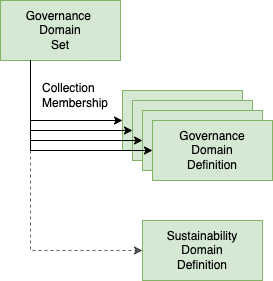

<!-- SPDX-License-Identifier: CC-BY-4.0 -->
<!-- Copyright Contributors to the Egeria project. -->

# Sustainability Governance Domain

A governance domain is a focus area for governance.  This sample creates a governance domain definition for
*sustainability*, which is used as a hub to link together all the pieces of the sustainability initiative.

There are two parts to this sample:

* Retrieving the existing governance domain definitions
* Adding a new governance domain definitions for sustainability with the following values:

This sample can be run multiple times, so it begins by deleting the sustainability governance domain definition
if it is already defined in the metadata server.

## Sustainability Domain Values

| Attribute Name | Value                                                                                                      |
| -------------- |------------------------------------------------------------------------------------------------------------|
| domainIdentifier | 9                                                                                                          |
| displayName | Sustainability Governance                                                                                  |
| description | Improving the use of resources to operate Coco Pharmaceuticals in a sustainable and non-damagining manner. |

----
License: [CC BY 4.0](https://creativecommons.org/licenses/by/4.0/), Copyright Contributors to the Egeria project.