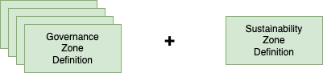

<!-- SPDX-License-Identifier: CC-BY-4.0 -->
<!-- Copyright Contributors to the Egeria project. -->

# Sustainability Governance Zone

Governance zones are used to group assets such as data sources that are needed
for a particular purpose.  This sample shows how to add the definition of a new zone
for sustainability.

----
License: [CC BY 4.0](https://creativecommons.org/licenses/by/4.0/), Copyright Contributors to the Egeria project.