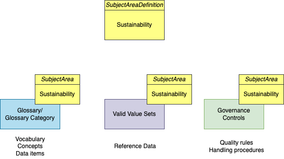
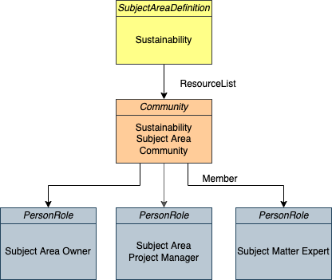

<!-- SPDX-License-Identifier: CC-BY-4.0 -->
<!-- Copyright Contributors to the Egeria project. -->

# Sustainability Subject Area

The sustainability initiative requires the people at Coco Pharmaceuticals
to learn new terminology along with new types of data
and processes to calculate emissions.  It is useful to be able
to collect this knowledge together.

Subject areas describe topics that are of interest to the organization.
They act as a collection point for related information and definitions.

## The Subject Area Definition

This sample begins by creating a subject area definition for "sustainability".
Elements that "belong" to the subject area are tagged using a *SubjectArea*
classification.  Other samples add this classification and so the sample also
lists the elements that belong to the subject area.

## The Subject Area Community

The team that maintains the subject area's information work together in a
community.  This part of the sample shows how to set up the community and
the roles needed to maintain the subject area.  Typically, these roles
are in addition to the work that they normally do.  
This work gave them the expertise, and the subject area role gives them time
to capture this knowledge for the benefit of the rest of the organization.

----
License: [CC BY 4.0](https://creativecommons.org/licenses/by/4.0/), Copyright Contributors to the Egeria project.