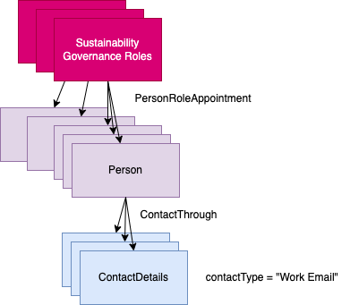

<!-- SPDX-License-Identifier: CC-BY-4.0 -->
<!-- Copyright Contributors to the Egeria project. -->

# Sustainability Team Emails

Driving the sustainability initiative involves people doing many roles.  To keep
these people up-to-date and enthusiastic, Coco Pharmaceuticals wants to send out
emails.  The aim of ths sample is to show how to retrieve the email addresses of the
people working on sustainability.

This sample has the following parts to it:

* Locate the sustainability governance roles.  These are governance roles where `domainIdentififer=9`.
* For each role, retrieve details of the person or persons who are appointed to the role.
* For each person, extract their contact details and find the one with `contactType = "Work Email"`.  The email address is stored in the `contactMethodValue` property.

It prints out a table with the following columns:

| Governance Role | Person Name    | Job Title | Contact Email                  |
|-----------------|----------------|-----------|--------------------------------|
| xxxxxxxxxxxxxx  | xxxxx xxxxxxxx | xxxxxxxxx | xxxxx@coco-pharmaceuticals.org |

This sample can be run multiple times, so it begins by deleting the elements it plans to create if they are already defined in the metadata server.

----
License: [CC BY 4.0](https://creativecommons.org/licenses/by/4.0/), Copyright Contributors to the Egeria project.