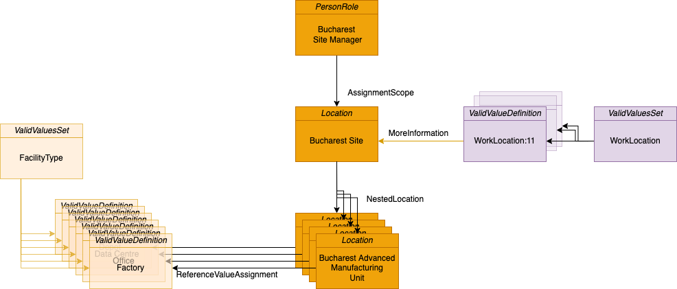

<!-- SPDX-License-Identifier: CC-BY-4.0 -->
<!-- Copyright Contributors to the Egeria project. -->

# New Bucharest Site

As part of Coco Pharmaceuticals' move to personalized medicine, they have needed to
purchase new manufacturing capability to handle the fast-turnaround of small batches.

The Bucharest site has just been purchased.  This sample shows how to create the new definitions
for this site so that it can be included in the sustainability initiative.

----
License: [CC BY 4.0](https://creativecommons.org/licenses/by/4.0/), Copyright Contributors to the Egeria project.