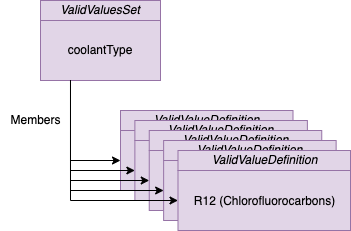
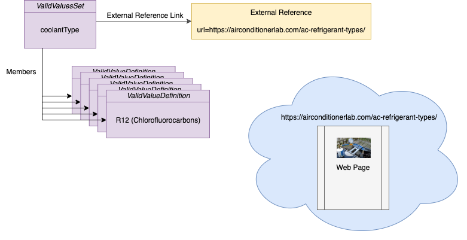

<!-- SPDX-License-Identifier: CC-BY-4.0 -->
<!-- Copyright Contributors to the Egeria project. -->

# CoolantType Valid Value Set

Coco Pharmaceuticals need to create an inventory of their refrigeration unit with the type of coolant they use.
The aim is to replace each refrigeration unit that uses CFCs of HCFCs since
these are ozone depleting chemicals.

A valid value set defines a list of the possible values for a property.
Coco Pharmaceuticals want a valid value set for the different types of coolant they use.
This can be used to validate the coolant information in the inventory
and to act as dropdowns in their sustainability dashboard.

## Building the valid value set

The valid value set in the sample uses the information on 
this web page [https://airconditionerlab.com/ac-refrigerant-types/] to 
extract the different types, with their descriptions and add them to 
a valid value set.

## Adding an External Reference

An external reference provides a pointer to a webpages or other document
that has been used to create the information in an open metadata element.
It shows the provenance of the information used to build the valid value list so that
it can be checked and validated as accurate.

The second part of the sample shows how to create the external reference
and add it to the valid value set.

----
License: [CC BY 4.0](https://creativecommons.org/licenses/by/4.0/), Copyright Contributors to the Egeria project.