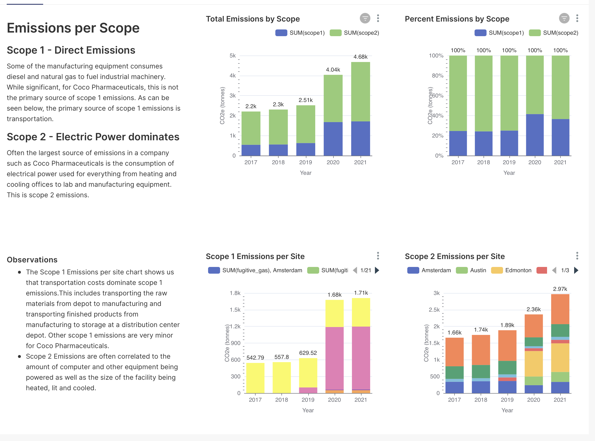
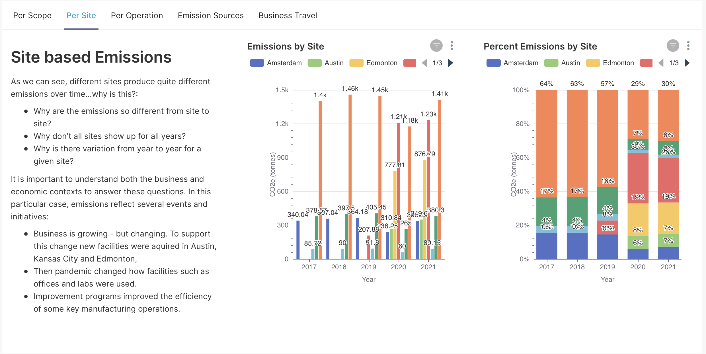
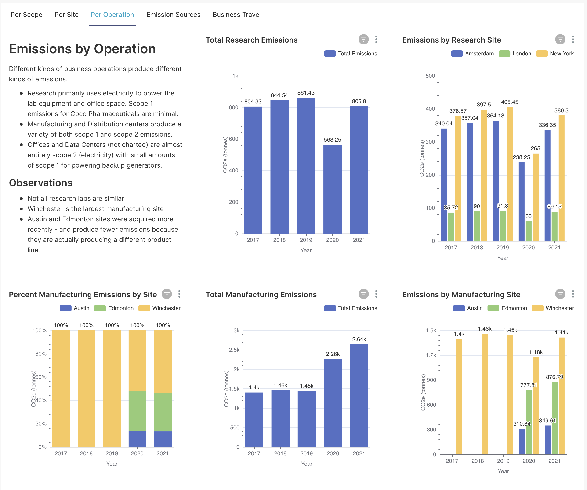

# Designing the Sustainability Supply Chain

To build the supply chain we need to first understand the requirements. A good way to start is to work backwards from the results we are trying to produce. In this case, we are producing a sustainability dashboard that documents Scope 1 and Scope 2 emissions across a number of dimensions - so lets start there.
## A quick look at the Dashboard

While we won't always be able to start with a concrete target such as this dashboard, in the case of sustainability reporting all we have to do is to look at the kinds of material different companies produce to get an idea of what Coco Pharmaceuticals will need to construct. With that in mind, we've put together the following prototype sustainability dashboard. This dashboard is for internal stakeholders within Coco Pharmaceuticals - it contains much more information than would typically be published to broader communities.

### Sustainability Dashboard - Enterprise Level
The main page of the dashboard looks similar to this:

These top graphs summarize Coco Pharmaceutical's equivalent carbon emissions over the last five years in total and per country they operate within. 
### Sustainability Dashboard - by Scope 

To gain a better understanding of how emissions are being produced and from where we need to be able to **drill-in** to the data to investigate further. The first step is to break the emissions down by scope:

This tells us that Scope 2 emissions from electric utilities are the primary contributors. We can also see that this starts to show how the different work locations (sites) contribute to the scope 1 and scope 2 totals.

### Sustainability Dashboard - by Site

We also want to understand how each of the work locations contributes to the overall enterprise emissions. These graphs shows the emissions for each site - note that the number of sites has increased over the years as the business continues to expand and change.

### Sustainability Dashboard - by Operation

To understand why some sites produce more emissions than others, it is important to consider what kinds of business operations are taking place. From the graphs we can see that some sites have a combination of offices workers, research and a computer room while manufacturing and distribution happens elsewhere. Manufacturing produces much more scope 1 emissions than research does.. 

It is important for us to gain a detailed understanding of how emissions are produced in order for realistic reduction targets to be set and improvement programs designed.

## Inferred requirements

By understanding the dashboard we can better understand some key requirements for the supply chain that we need to design and implement:
* Collect data and calculate scope 1 and scope 2 emissions
* Collect information per site and operation
* Store the information over time to create yearly comparisons
* Aggregate data across time, site, scope, operations
* Accomodate change - new sites, changing operations, changing business structure, business expansion

## Designing a supply chain

The inferred requirements are the beginning of the supply chain design process. As we continue to work backwards, the issues that we have to address include:
* How often does the dashboard need to be updated?
* How often do emissions calculations need to be run?
* How are we going to execute these calculations?
* Where is the data for these calculations coming from?
* How do we need to prepare this data for calculations to be performed?
* Who owns the source data that we need?

Working through these questions leads us to break the supply chain down into three logical stages:
1. Collect data from source systems
2. Refine and process this data to calculate emissions
3. Store the results and aggregations for analysis and reporting

These stages are discussed further in **Creating the Data Pipeline**
