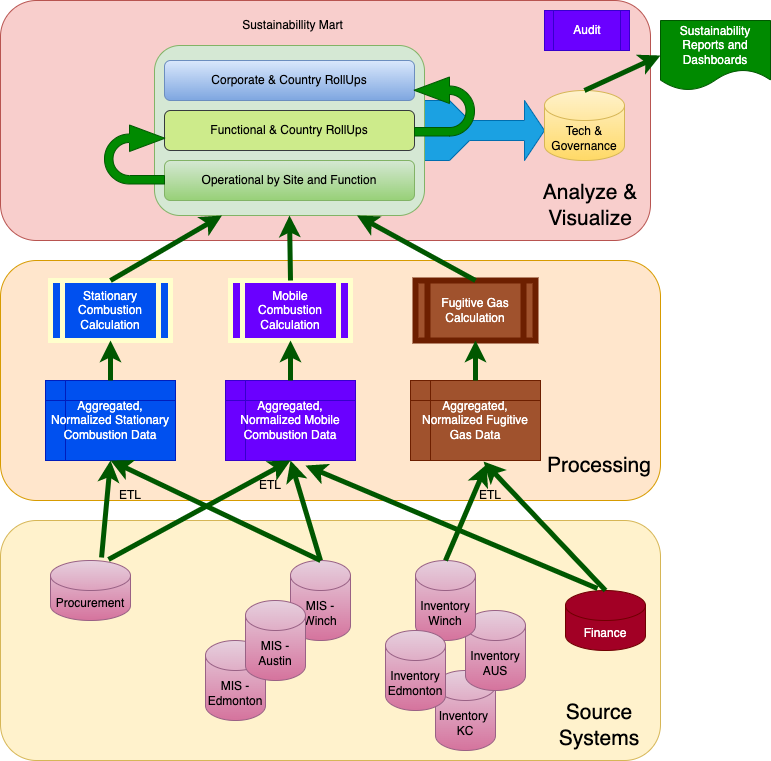
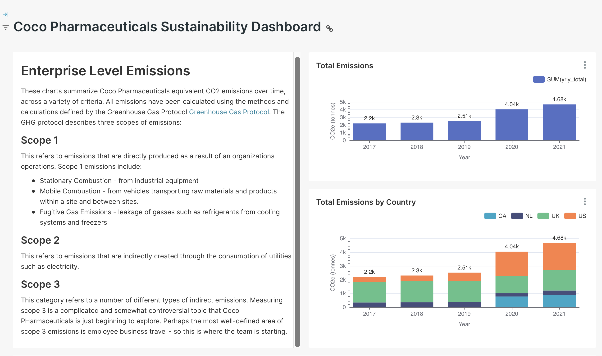

<!-- SPDX-License-Identifier: CC-BY-4.0 -->
<!-- Copyright Contributors to the Egeria project. -->[

# Create supply chain for sustainability dashboard

 Information supply chains provide the right information at the right times to the sustainability dashboard. The diagram below shows the supply chain for scope 1 emissions. There are three stages:
1. Collect data from source systems
2. Refine and process this data to calculate emissions
3. Store the results and aggregations for analysis and reporting

## Collecting Data
The governance team has identified the source systems containing the relevant activity data for each kind of activity represented. For example, the team identified a Procurement database for information about fuel used in manufacturing equipment.

## Refining and Processing Data
Data that we acquire from other systems needs to be refined for it to be used in sustainability calculations. For example, the Procurement database holds data about fuel purchases - but since the purchases are happenign in different countries, the quantity of fuel might be measured in Liters for one site and Gallons in another - we need to normalize these units so that we can calculate totals. Other kinds of transformation address quality issues and create different aggregations.

Once the data has been brought together, cleansed and noramized, we can run sustainability calculations that compute the amount of equivalent carbon dioxide produced for each activity. These results can then be passed to the next stage.

## Store, Analyze, Report
The emissions calculated in the previous step are stored in the Sustainability Data Mart. These raw results are then "rolled-up" in different dimensions to allow us to analyze and report on emissions across the entire enterprise and then drill down through different dimensions such as site, emissions source, and type of business operation. The resulting report looks something like this:

 

----
License: [CC BY 4.0](https://creativecommons.org/licenses/by/4.0/), Copyright Contributors to the Egeria project.
